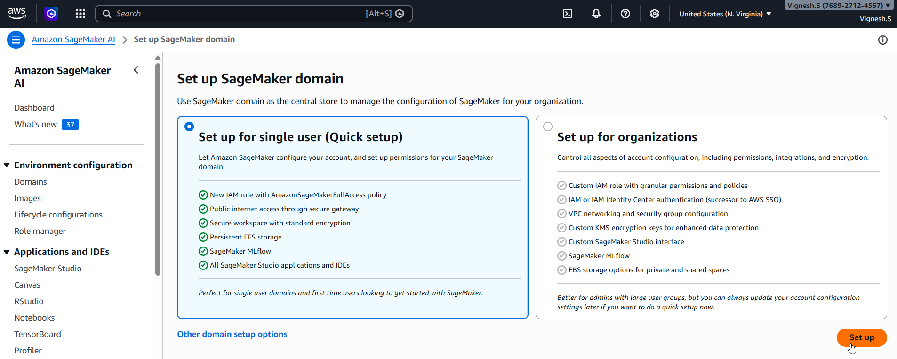
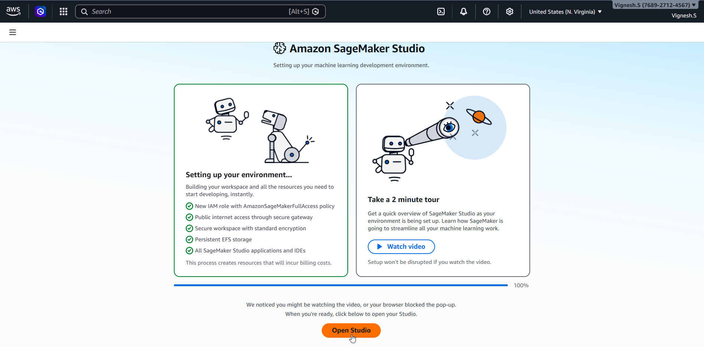
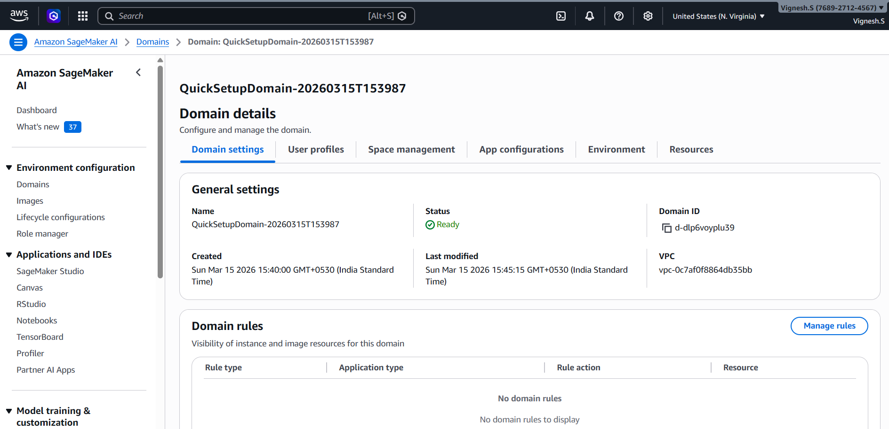
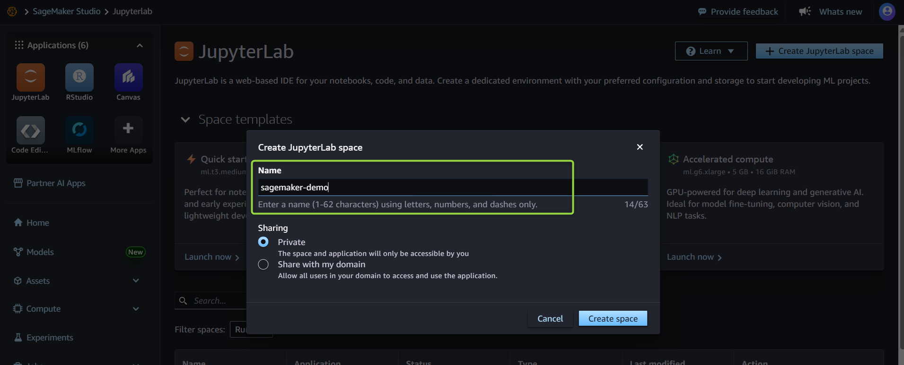
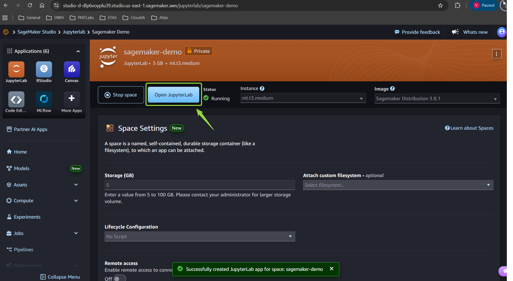
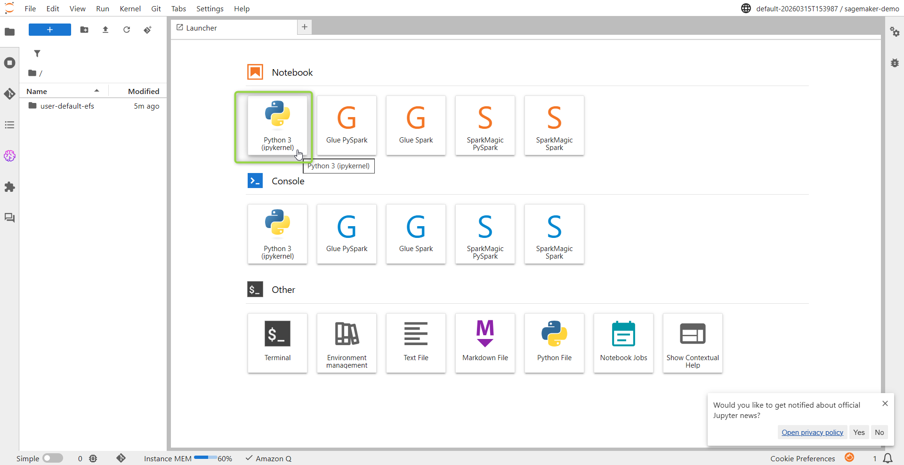
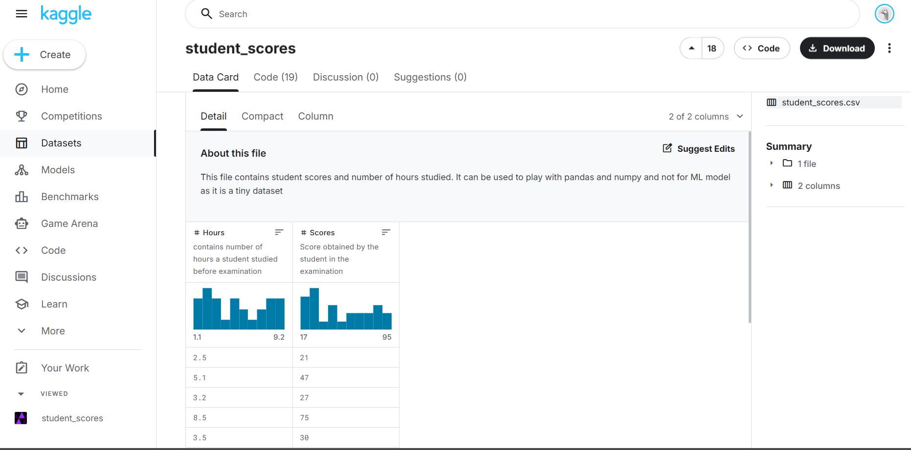

# sagemaker-student-score-predictor
This project demonstrates an end-to-end Machine Learning workflow using AWS SageMaker.
The project trains a model using student study hours data and deploys it as a SageMaker endpoint for real-time predictions.

## Project Overview
This project covers:
- Data loading using Pandas
- Uploading dataset to Amazon S3
- Training model using SageMaker Linear Learner
- Deploying model to SageMaker endpoint
- Running real-time predictions

## Dataset Used
student_score.csv

## Technologies Used
- Python
- AWS SageMaker
- Boto3
- Pandas
- NumPy
- Scikit-learn
- Amazon S3

## Prerequisite

## Steps to be executed

1. Load Dataset
df = pd.read_csv("student_scores.csv")

2. Split Data
train_test_split()

3. Upload to S3
boto3
sagemaker.Session()

4. Train Model in SageMaker

Using built-in Linear Learner algorithm.

5. Deploy Endpoint

Model deployed using SageMaker endpoint.

6. Run Prediction
Send input data => get predicted score.
